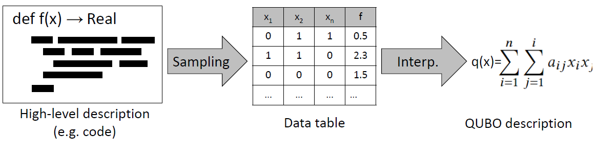

 #  自动Qubo生成器

自动Qubo生成器是一种用于转换高级描述的自动工具
将用Python编写的优化问题转换为等价的Qubo表示。
它通过使用一种新颖的**数据驱动**翻译方法来实现这一点，该方法
可以完全解耦输入和输出表示。

<p align="center">

</p>


该存储库可作为我们出版物的补充:

1.阿尔贝托·莫拉格里奥、塞尔班·杰奥尔杰斯库和普热梅斯瓦夫·萨多夫斯基。2022.Autoqubo：数据驱动的自动qubo生成。遗传与进化计算会议指南（GECCO 22 Companion），2022年7月9日至13日，美国马萨诸塞州波士顿。美国计算机学会（ACM），美国纽约州纽约市，8页。https：//doi.org/10.1145/3520304.3533965

2.：贾斯廷·保克特、马约瓦·阿约德勒、马科斯·迭斯·加西亚、塞尔班·杰奥尔杰斯库和马蒂厄·帕里齐。2023.AUTOQUBO V2:伊辛机器的高效和有效的QUBO公式。遗传和进化计算会议指南（GECCO 23指南），2023年7月15-19日，葡萄牙里斯本。ACM，纽约，纽约州，美国，4页。https://doi.org/10.1145/3583133.3590662

安装
------------

将autoqubo安装为软件包：
```
pip install autoqubo
```

引用
-----------
如果你觉得我们的代码有用，请在您的工程目录下发引用下面的代码:

```
@inproceedings{10.1145/3520304.3533965,
    author = {Moraglio, Alberto and Georgescu, Serban and Sadowski, Przemys{\l}aw},
    title = {AutoQubo: Data-driven Automatic QUBO Generation},
    year = {2022},
    isbn = {978-1-4503-9268-6/22/07},
    publisher = {Association for Computing Machinery},
    doi = {10.1145/3520304.3533965},
    booktitle = {Proceedings of the Genetic and Evolutionary Computation Conference Companion},
    series = {GECCO '22} 
}
```


